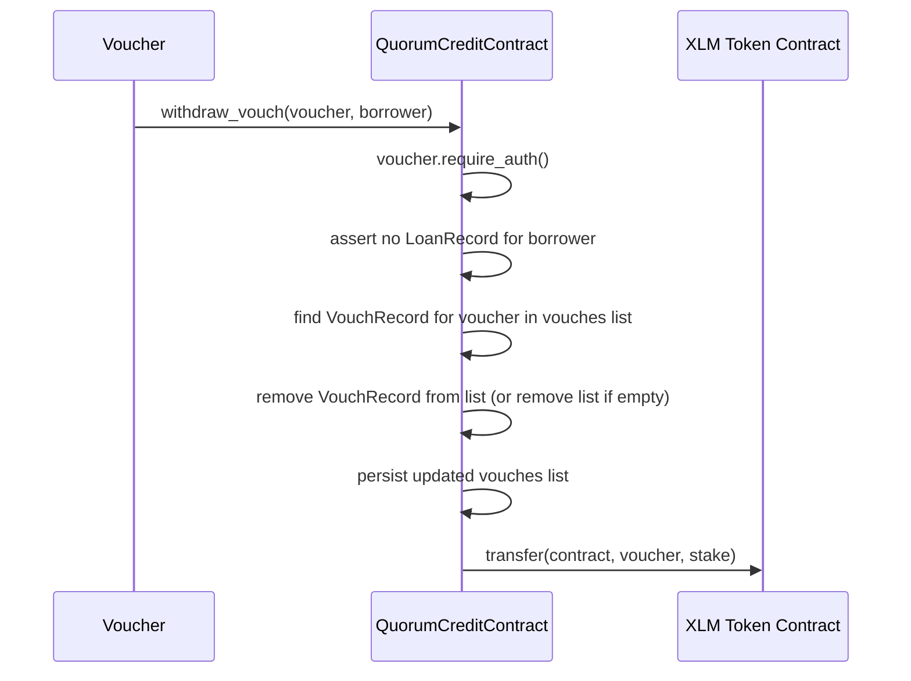

# Design Document: withdraw-vouch

## Overview

The `withdraw_vouch` function gives vouchers an exit path before a loan is active. When a voucher has staked XLM for a borrower who has not yet called `request_loan`, the voucher can call `withdraw_vouch(voucher, borrower)` to reclaim their exact original stake. Once any `LoanRecord` exists for the borrower (active, repaid, or defaulted), the normal `repay`/`slash` flows govern stake return and this function is blocked.

This is a pure state-cleanup operation: it removes one `VouchRecord` from the borrower's vouch list and transfers the recorded stake amount back to the voucher — no yield, no penalty.

## Architecture

The feature fits entirely within the existing `QuorumCreditContract` in `src/lib.rs`. No new storage keys, data types, or external dependencies are needed.



The call flow mirrors `vouch` in reverse: where `vouch` pushes a record and pulls tokens in, `withdraw_vouch` removes the record and pushes tokens out.

## Components and Interfaces

### New function: `withdraw_vouch`

```rust
pub fn withdraw_vouch(env: Env, voucher: Address, borrower: Address)
```

Added as a method on `QuorumCreditContractClient` (generated by the SDK macro).

**Steps (in order):**

1. `voucher.require_auth()` — enforces voucher-only authorization.
2. Assert `env.storage().persistent().get(&DataKey::Loan(borrower.clone())).is_none()` — panics with `"loan already active"` if a loan record exists.
3. Load `Vec<VouchRecord>` from `DataKey::Vouches(borrower.clone())` — panics with `"vouch not found"` if the list is absent or contains no record matching `voucher`.
4. Find the index of the matching `VouchRecord`, record its `stake`, and remove it from the vector.
5. If the resulting vector is empty, remove `DataKey::Vouches(borrower)` from persistent storage; otherwise write the updated vector back.
6. Transfer `stake` stroops from the contract to `voucher` via the token client.

### Existing interfaces (unchanged)

| Function | Role |
|---|---|
| `vouch` | Adds a `VouchRecord` and transfers stake in |
| `request_loan` | Creates a `LoanRecord`; blocks `withdraw_vouch` after this point |
| `repay` / `slash` | Return/burn stake once a loan exists |
| `get_vouches` | View helper used in tests |
| `get_loan` | View helper used in tests |

## Data Models

No new storage keys or types are introduced.

### Relevant existing types

```rust
#[contracttype]
pub enum DataKey {
    Loan(Address),    // borrower → LoanRecord  (read to check for active loan)
    Vouches(Address), // borrower → Vec<VouchRecord>  (mutated by withdraw_vouch)
    Token,            // read to get token client
}

#[contracttype]
#[derive(Clone)]
pub struct VouchRecord {
    pub voucher: Address,
    pub stake: i128,  // exact amount returned on withdrawal
}
```

### Storage mutation summary

| Key | Before | After |
|---|---|---|
| `Vouches(borrower)` | `Vec` containing the target `VouchRecord` | Same `Vec` with that record removed; key deleted if vec becomes empty |
| `Loan(borrower)` | Must be absent (else panic) | Unchanged (not written) |

